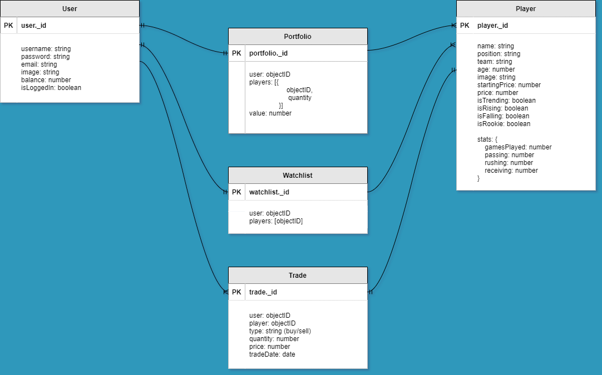
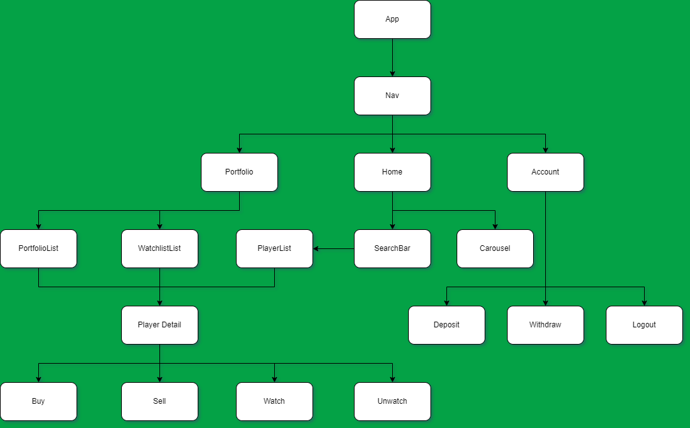
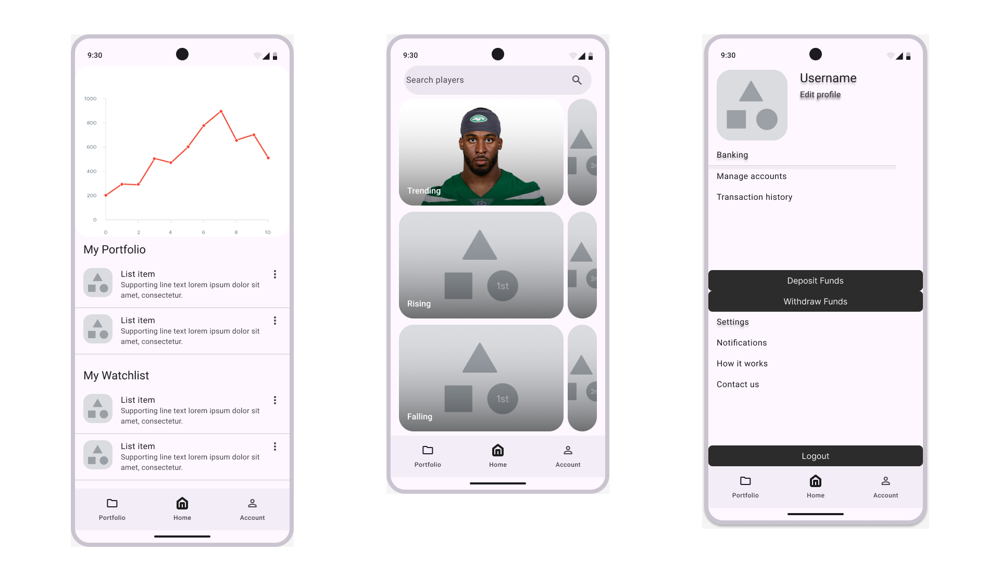

# Football Stock Exchange

## Entity Relationship Diagram

## Component Hierarchy Diagram

## Wireframes

## Technologies Used
- HTML, CSS, JavaScript
- React
- MongoDB, Atlas
- Bootstrap
- Trello, draw.io

## Resources
- ChatGPT
- Background image source: https://static.clubs.nfl.com/image/private/t_new_photo_album/jets/qhsgjtl4udb0brklchxg.jpg